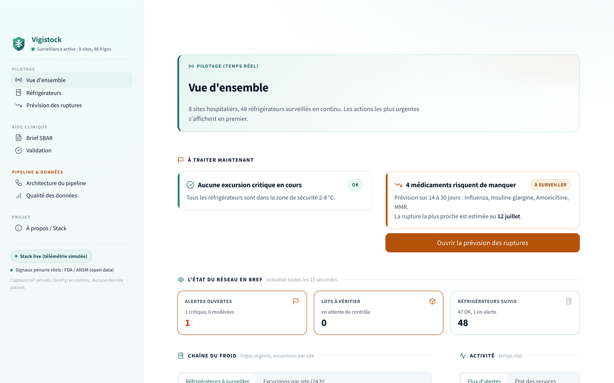
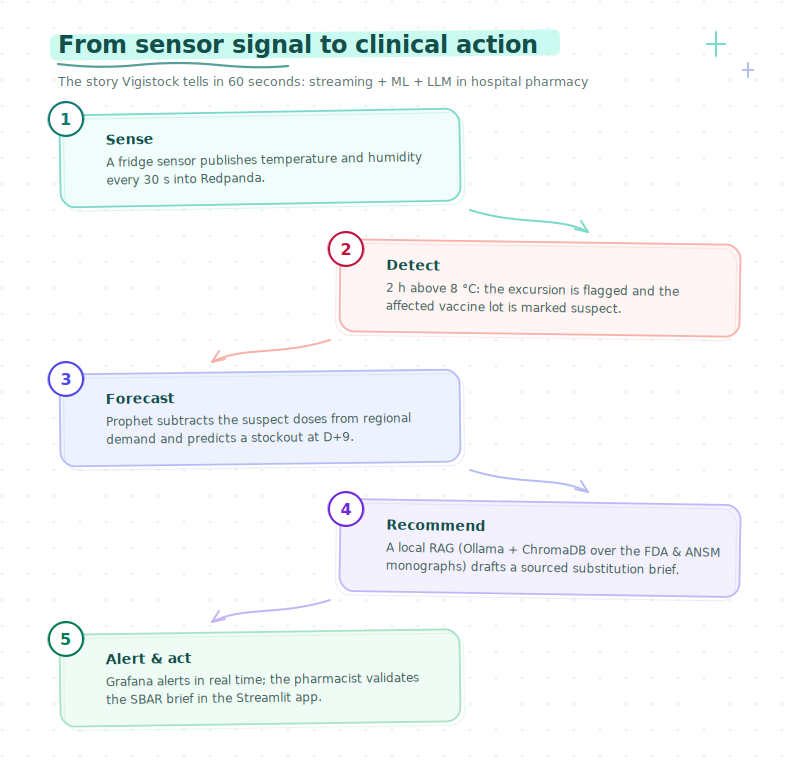
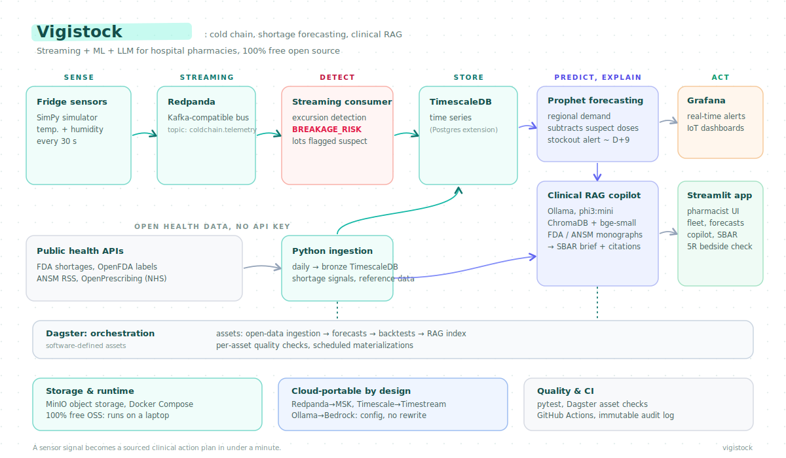
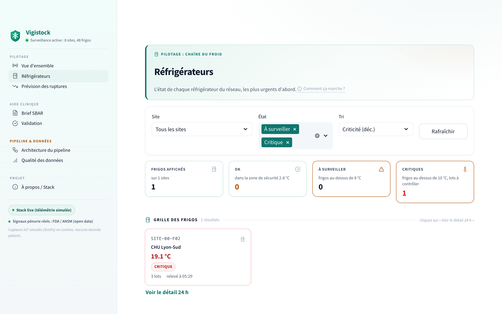
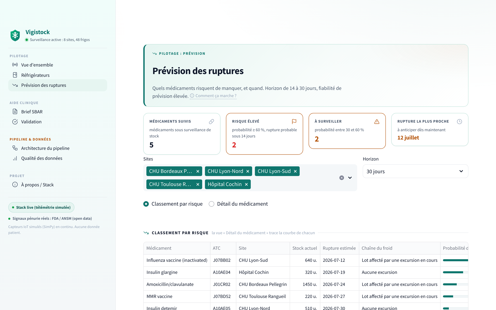
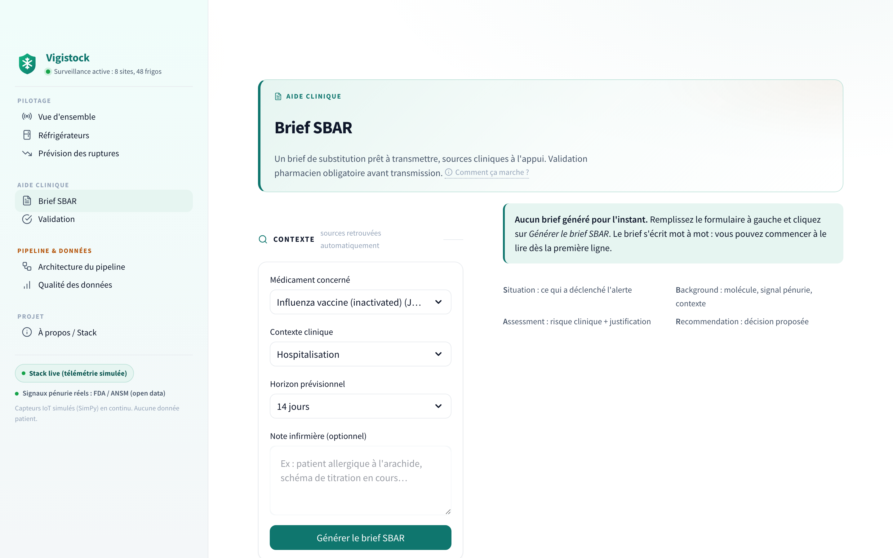
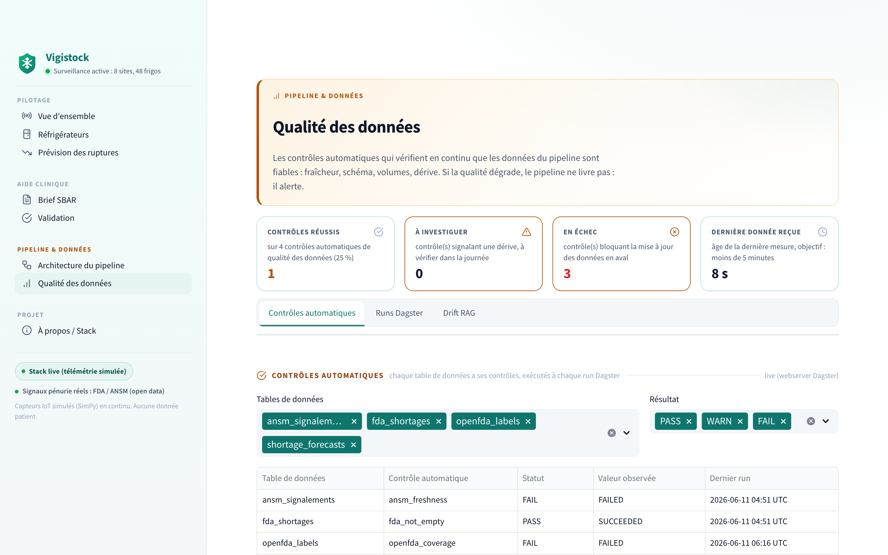
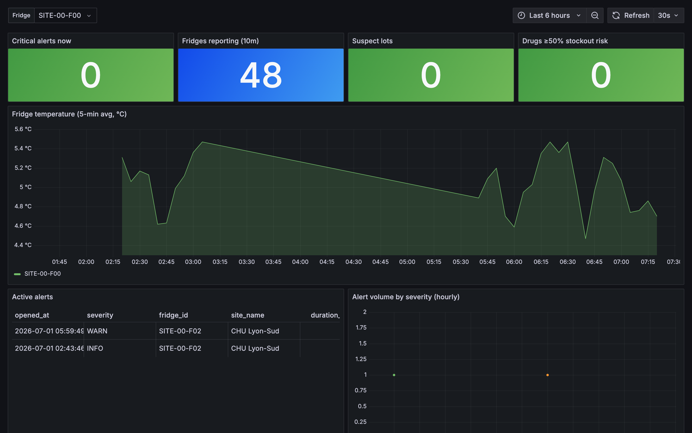
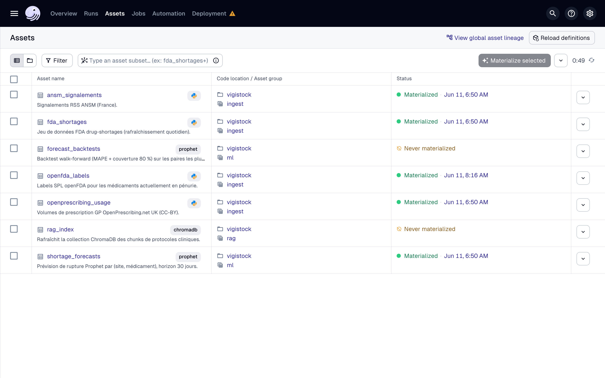

<div align="center">

# Vigistock

### IoT monitoring & drug-shortage prevention

**Real-time cold-chain monitoring, drug-shortage forecasting, clinical RAG assistant**

For hospital pharmacies. Streaming, ML and a local LLM, end to end, built entirely on open-source components.


**English** - [Français](README.md)

</div>

<p align="center">
  
</p>

## Table of contents

- [Why this project](#why-this-project)
- [What the pipeline does](#what-the-pipeline-does)
- [Quick start](#quick-start)
- [Architecture](#architecture)
- [Stack and portability](#stack-and-portability)
- [Data sources](#data-sources)
- [The pharmacist application](#the-pharmacist-application)
- [Observability and orchestration](#observability-and-orchestration)
- [Tests and CI](#tests-and-ci)
- [Repository layout](#repository-layout)
- [Engineering notes](#engineering-notes)
- [Scope and limitations](#scope-and-limitations)
- [Documentation](#documentation)
- [About](#about)

## Why this project

This project is rooted in field experience as a caregiver, where a drug shortage is anything but abstract: a fridge that silently drifts out of range, a vaccine lot quarantined too late, and an on-call doctor phoning nearby hospitals to find a substitute.

The scale of the problem is well documented. The U.S. FDA tracked 323 active shortages in Q1 2024, the highest figure in a decade, and the EMA shortage platform lists around 250 active EU shortages at any time. Cold-chain failures are a recurring root cause: the WHO estimates that 25 % of vaccines are degraded by the time they reach patients, mostly because of temperature excursions nobody noticed in time.

Today, the pharmacist who has to react juggles three disconnected tools: a fridge dashboard, an inventory system, and a stack of PDF substitution protocols. This project connects them into a single event-driven pipeline that detects the excursion, predicts the downstream shortage, and drafts a sourced substitution brief.

## What the pipeline does

A simulated fridge fleet reports telemetry every 30 seconds. When a fridge leaves the 2-8 °C range for too long, the affected lots become suspect, the demand forecast is updated, and the pharmacist receives an actionable brief grounded in official drug documents. End to end, a sensor blip becomes a clinical action plan in under a minute, with citations.

<p align="center">
  
</p>

| Step | What happens | Code |
| --- | --- | --- |
| 1. Sense | The SimPy simulator ships temperature and humidity readings every 30 s to Redpanda. | `simulator/` |
| 2. Detect | A streaming consumer applies a rolling Z-score plus duration thresholds, flags the excursion as `BREAKAGE_RISK` and marks the affected vaccine lot as suspect. | `streaming/consumer.py`, `streaming/anomaly.py` |
| 3. Forecast | Prophet retrains the regional demand model, subtracts the suspect doses and predicts the stock-out date. | `ml/shortage_forecast.py` |
| 4. Recommend | A local LLM (Ollama) retrieves the relevant FDA and ANSM monographs from ChromaDB and drafts a substitution brief with citations. | `llm/` |
| 5. Act | Grafana raises the real-time alert; the Streamlit app shows the pharmacist an SBAR brief with alternatives and nearby surplus stock. | `dashboards/` |

## Quick start

Prerequisites: Docker Desktop with at least 8 GB of RAM allocated. No cloud account, no API key.

```bash
make up             # full stack: the database is initialised and seeded (db-init),
                    # the IoT simulator and the streaming consumer start as services,
                    # the Ollama models are pulled on first start
```

A single command is enough. `make up` starts the full pipeline: `db-init` applies the schema and seeds the reference data (sites, fridges, drugs, lots, dispensing history), the simulator pushes telemetry into Redpanda, and the streaming consumer fills TimescaleDB continuously. The dashboard then shows the real pipeline output, not a frozen demo. Live mode is the default (`USE_MOCK_DATA=false`), with automatic fallback to the mock if the database is unavailable.

Then open:

| URL | Service |
| --- | --- |
| http://localhost:8501 | Streamlit pharmacist app (live data) |
| http://localhost:3000 | Grafana real-time IoT dashboards (admin / admin) |
| http://localhost:3001 | Dagster orchestration UI |

Check that live data is being served:

```bash
docker compose logs streamlit | grep -i "repli"   # no line expected
docker compose exec timescaledb psql -U vigistock -d vigistock \
  -c "SELECT COUNT(*) FROM silver.telemetry_raw"  # grows on every tick
```

To trigger the open-data ingestion and the forecast without waiting for the
nightly schedule: `make pipeline` (schema + seed + ingest + Prophet).

To run the Streamlit app without Docker:

```bash
pip install -r requirements.txt
make app            # streamlit run dashboards/streamlit/app.py
```

To tear everything down: `make down` (keeps volumes) or `make nuke` (clean slate). `make help` lists every target.

Migration note: the images now run unprivileged (user `app`). If a
`dagster-home` volume created by an older version exists, recreate it once
with `make nuke` before running `make up` again.

## Architecture

<p align="center">
  
</p>

Dagster orchestrates the batch side: ingestion assets, the nightly forecast, the RAG index refresh and the data-quality checks are all software-defined assets. The streaming side runs independently, so a slow public API never delays an alert. The full diagram and the reasoning behind it are in [`docs/architecture.md`](docs/architecture.md).

## Stack and portability

Every component was picked for exposing a standard API, so each one can be swapped for a managed cloud service through configuration, not a rewrite.

| Layer | In this repo | Managed equivalents |
| --- | --- | --- |
| Streaming bus | Redpanda (Kafka API) | Amazon MSK, Confluent Cloud, Azure Event Hubs |
| Time-series DB | TimescaleDB (Postgres extension) | Amazon Timestream, GCP Bigtable, Azure Data Explorer |
| Orchestrator | Dagster (software-defined assets) | Dagster Cloud, MWAA, Cloud Composer |
| Forecasting | Prophet | SageMaker Forecast, Vertex AI Forecast |
| LLM | Ollama (phi3:mini), local | Bedrock, Vertex AI, Azure OpenAI |
| Vector store | ChromaDB | OpenSearch, pgvector, Azure AI Search |
| Embeddings | bge-small-en, local | Bedrock Titan, text-embedding-3-small |
| Real-time dashboards | Grafana | Managed Grafana, Cloud Monitoring |
| App layer | Streamlit | Streamlit Cloud, App Runner, Cloud Run |

An optional Terraform blueprint for an AWS deployment lives in [`infra/terraform/`](infra/terraform/).

## Data sources

Every source is public, requires no authentication, and is legal to reuse, so anyone can clone the repo and reproduce the same flows.

| Source | Type | Endpoint | License | Frequency |
| --- | --- | --- | --- | --- |
| FDA Drug Shortages | REST API | `api.fda.gov/drug/shortages.json` | Public domain | Real time |
| openFDA Drug Labels | REST API | `api.fda.gov/drug/label.json` | CC0 | Real time |
| ANSM (France) | RSS feed | `ansm.sante.fr/actualites.rss` | Public data | Daily |
| OpenPrescribing (NHS) | REST API | `openprescribing.net/api/1.0` | CC BY 4.0 | Weekly |
| IoT telemetry | SimPy simulator | local (Redpanda) | Project code | On demand |

The fridge telemetry is synthetic by necessity: hospitals do not publish operational data. The simulator's physics (operating ranges, hold-over times, compressor failure rates) follows the WHO PQS specifications, detailed in [`docs/data_sources.md`](docs/data_sources.md).

## The pharmacist application

The UI is a multi-page Streamlit application (`dashboards/streamlit/`) wired to the same data layer as Grafana and Dagster. It is built as a product rather than a demo: a single design system (`lib/theme.py`, `lib/style.py`, `lib/components.py`), a WCAG AA palette, auto-refresh through `st.fragment`, and token-by-token LLM streaming with `st.write_stream`.

| Overview : live KPIs, excursion-to-shortage causal bridge | Cold-chain fleet : master/detail, 24 h bands |
| --- | --- |
|  |  |
| **Shortage forecast : Prophet curves, 80 % confidence** | **Clinical copilot : streamed SBAR brief, citations** |
|  |  |

<p align="center">
  
</p>

The eight pages: Overview (live KPIs, critical fridges, alert feed), Cold-chain fleet (master/detail, 24 h tolerance bands, lot quarantine), Shortage forecast (Prophet curves with 80 % confidence intervals), Clinical Copilot (streamed SBAR brief, alternatives, RAG citations), Validation (pharmacist gate plus bedside nurse checklist, audit log), Architecture, Data quality (Dagster asset checks, RAG drift), and About.

## Observability and orchestration

The same data layer feeds three surfaces, one per audience: Grafana for real-time monitoring (ops), Dagster for orchestration (engineering), and the Streamlit app for the pharmacist.

| Grafana: real-time cold chain, Kafka lag, alerts | Dagster: asset graph, runs, asset checks |
| --- | --- |
|  |  |

## Tests and CI

```bash
make test                # unit tests (fast, no Docker)
make test-integration    # integration tests (needs the running stack)
make ci                  # what CI runs: lint + unit tests
```

The GitHub Actions workflow runs lint and unit tests (with coverage) on every push, then the integration tests against real containers via testcontainers. A dedicated security job runs bandit (blocking on high severity) and pip-audit; the docker-build workflow builds both images and scans them with Trivy.

## Repository layout

```
vigistock/
├── simulator/              # SimPy cold-chain telemetry generator
├── streaming/              # Redpanda consumer + anomaly detection
├── ingestion/              # FDA, openFDA, ANSM, OpenPrescribing batch extractors
├── ml/                     # Prophet forecasting + shortage cascade
├── llm/                    # RAG: chunking, ChromaDB indexer, Ollama client
├── orchestration/dagster/  # software-defined assets, schedules, sensors, checks
├── dashboards/
│   ├── streamlit/          # pharmacist UI (8 pages, design system)
│   └── grafana/            # provisioned real-time dashboards
├── sql/                    # TimescaleDB DDL: hypertables, continuous aggregates
├── protocols/              # seed substitution protocols (RAG corpus)
├── notebooks/              # exploratory analysis
├── tests/                  # unit + integration (testcontainers)
├── infra/                  # optional Terraform blueprint (AWS)
├── scripts/                # utilities
├── docs/                   # architecture, data sources, governance, LLM notes
├── docker-compose.yml
└── Makefile                # make help lists every target
```

## Engineering notes

A few implementation details that received particular attention:

- At-least-once delivery from Redpanda to TimescaleDB, with idempotent upserts so replays never duplicate rows.
- Anomaly detection in flight (rolling Z-score plus duration threshold), not as an after-the-fact batch job.
- A lambda layout: streaming for telemetry, batch for the slow public APIs, both feeding the same time-series store.
- Production-shaped ML: Prophet retrained on a Dagster schedule, predictions written back to Postgres and evaluated with backtests.
- A grounded RAG: every claim in the substitution brief must cite a retrieved chunk, and a validator rejects briefs whose citations do not match the corpus.
- Healthcare data governance: no personal health information ever leaves the perimeter, because the LLM and the embeddings run locally. The HIPAA and GDPR reasoning is documented in [`docs/governance_hipaa_rgpd.md`](docs/governance_hipaa_rgpd.md).

## Scope and limitations

This is a portfolio project. It runs end to end on a laptop, the public data flows are real, and the streaming and LLM components are production-shaped (retries, backpressure, idempotence). It is not a medical device and must not be used for actual clinical decisions; see [`docs/governance_hipaa_rgpd.md`](docs/governance_hipaa_rgpd.md) for the explicit disclaimer.

## Documentation

| Document | Contents |
| --- | --- |
| [`docs/architecture.md`](docs/architecture.md) | Full topology and rationale for the technical choices. |
| [`docs/data_sources.md`](docs/data_sources.md) | Public data sources, licences and the simulator (WHO PQS specs). |
| [`docs/llm_rag.md`](docs/llm_rag.md) | RAG pipeline: chunking, ChromaDB index, citation validation. |
| [`docs/governance_hipaa_rgpd.md`](docs/governance_hipaa_rgpd.md) | HIPAA / GDPR posture, data-subject rights, retention policy. |

---

<p align="center">
  Built by <strong>Lohana Utim</strong>, Vigistock
</p>
