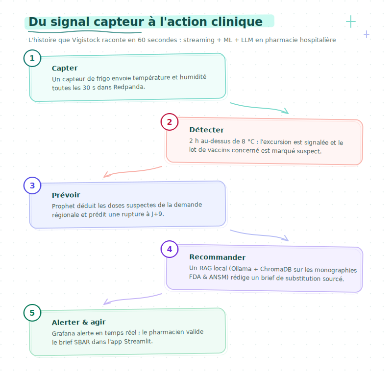
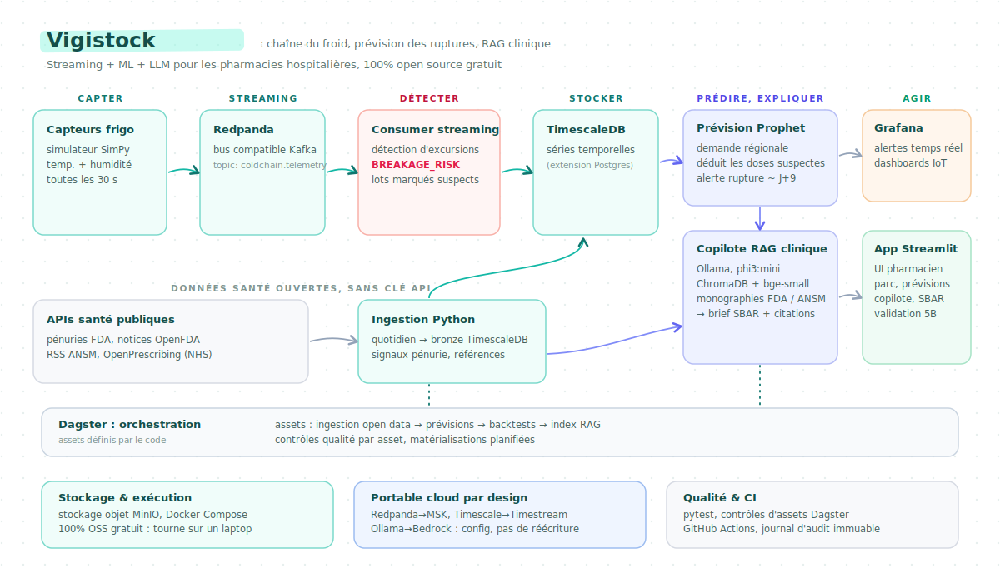

<div align="center">

# Vigistock

### Suivi IoT & Prévention des ruptures de médicaments

**Monitoring chaîne du froid temps réel, prévision des ruptures, assistant RAG clinique**

Pour les pharmacies hospitalières. Streaming, ML et LLM local, de bout en bout, uniquement avec des composants open source.


**Français** - [English](README.en.md)

</div>

<p align="center">
  
</p>

## Sommaire

- [Pourquoi ce projet](#pourquoi-ce-projet)
- [Ce que fait le pipeline](#ce-que-fait-le-pipeline)
- [Démarrage rapide](#démarrage-rapide)
- [Architecture](#architecture)
- [Stack et portabilité](#stack-et-portabilité)
- [Sources de données](#sources-de-données)
- [L'application](#lapplication)
- [Observabilité et orchestration](#observabilité-et-orchestration)
- [Tests et CI](#tests-et-ci)
- [Structure du repo](#structure-du-repo)
- [Notes](#notes)
- [Périmètre et limites](#périmètre-et-limites)
- [Documentation](#documentation)

## Pourquoi ce projet

Ce projet est inspiré d'expériences de terrain en tant que soignante, où une rupture de médicament est un vrai problème : un frigo qui dérive hors plage sans que personne ne s'en aperçoive, un lot de vaccins mis en quarantaine trop tard, et un médecin de garde qui téléphone aux hôpitaux voisins pour trouver une substitution.

L'ampleur du problème est bien documentée. La FDA américaine a recensé 323 ruptures actives au T1 2024, le chiffre le plus élevé en dix ans, et la plateforme de suivi de l'EMA liste en permanence environ 250 ruptures actives en UE. Les défaillances de chaîne du froid en sont une cause récurrente : l'OMS estime que 25 % des vaccins sont dégradés à leur arrivée aux patients, principalement à cause d'excursions de température détectées trop tard.

Aujourd'hui, le professionnel de santé qui doit réagir jongle avec trois outils déconnectés : un dashboard frigo, un système d'inventaire et une pile de PDF de protocoles de substitution. Ce projet les relie en un seul pipeline événementiel qui détecte l'excursion, prédit la rupture en aval et rédige un brief de substitution sourcé.

## Ce que fait le pipeline

Une flotte de frigos simulée envoie sa télémétrie toutes les 30 secondes. Quand un frigo sort trop longtemps de la plage 2-8 °C, les lots concernés deviennent suspects, la prévision de demande est mise à jour, et l'équipe soignante reçoit un brief actionnable appuyé sur les documents officiels du médicament. De bout en bout, un signal capteur devient un plan d'action clinique en moins d'une minute, avec citations.

<p align="center">
  
</p>

| Étape | Ce qui se passe | Code |
| --- | --- | --- |
| 1. Capter | Le simulateur SimPy envoie température et humidité toutes les 30 s vers Redpanda. | `simulator/` |
| 2. Détecter | Un consumer streaming applique un Z-score glissant et des seuils de durée, marque l'excursion `BREAKAGE_RISK` et flague le lot de vaccins comme suspect. | `streaming/consumer.py`, `streaming/anomaly.py` |
| 3. Prévoir | Prophet réentraîne le modèle de demande régional, soustrait les doses suspectes et prédit la date de rupture de stock. | `ml/shortage_forecast.py` |
| 4. Recommander | Un LLM local (Ollama) récupère les monographies FDA et ANSM pertinentes dans ChromaDB et rédige un brief de substitution avec citations. | `llm/` |
| 5. Agir | Grafana déclenche l'alerte en temps réel ; l'application Streamlit présente un brief SBAR avec alternatives et stocks excédentaires à proximité. | `dashboards/` |

## Démarrage rapide

**Cycle de vie de la stack**

- `make up` : démarre toute la stack (Redpanda, TimescaleDB, Grafana, Ollama, Streamlit et Dagster) en arrière-plan, puis affiche les URLs d'accès.
- `make down` : arrête la stack en conservant les volumes (les données restent intactes au prochain démarrage).
- `make nuke` : arrête tout et supprime les volumes, pour repartir d'un environnement totalement vierge.
- `make logs` : suit en direct les logs de tous les conteneurs.
- `make help` : liste toutes les cibles du Makefile avec leur description.

Redémarrer proprement : `make down && make up`.

Puis ouvrir :

| URL | Service |
| --- | --- |
| http://localhost:8501 | Application Streamlit pour les professionnels de santé |
| http://localhost:3000 | Dashboards Grafana IoT temps réel (admin / admin) |
| http://localhost:3001 | UI d'orchestration Dagster |

**Alimenter le pipeline de données**

- `make pipeline` : pipeline batch complet qui applique le schéma, seede les référentiels, lance l'ingestion open data puis la prévision Prophet.
- `make ingest` : relance uniquement l'ingestion des sources publiques (FDA Drug Shortages, openFDA, RSS ANSM, OpenPrescribing).
- `make forecast` : relance uniquement la prévision de rupture Prophet sur les données déjà ingérées.
- `make seed` : recharge les données de référence (sites, réfrigérateurs, médicaments, lots, historique de dispensation).
- `make schema` : (ré)applique le schéma TimescaleDB (hypertables et agrégats continus).
- `make index-rag` : (ré)indexe les protocoles cliniques dans ChromaDB pour le copilote RAG.
- `make pull-models` : télécharge le modèle de chat local Ollama (phi3:mini).

**Lancer l'application seule, sans Docker**

- `make install` : installe les dépendances Python dans le virtualenv actif.
- `make app` : démarre l'application Streamlit en local, sans la stack Docker.

Une fois la stack démarrée, le dashboard affiche directement les vraies sorties du pipeline, en temps réel.

## Architecture

<p align="center">
  
</p>

Dagster orchestre la partie batch : les assets d'ingestion, la prévision nocturne, le rafraîchissement de l'index RAG et les contrôles de qualité de données sont tous des assets software-defined. La partie streaming tourne indépendamment, donc une API publique lente ne retarde jamais une alerte. Le diagramme complet et les choix associés sont dans [`docs/architecture.md`](docs/architecture.md).

## Stack et portabilité

Chaque composant a été choisi pour exposer une API standard : chacun peut être remplacé par un service cloud managé via la configuration, sans réécriture.

| Couche | Dans ce repo | Équivalents managés |
| --- | --- | --- |
| Bus streaming | Redpanda (API Kafka) | Amazon MSK, Confluent Cloud, Azure Event Hubs |
| Base time-series | TimescaleDB (extension Postgres) | Amazon Timestream, GCP Bigtable, Azure Data Explorer |
| Orchestrateur | Dagster (assets software-defined) | Dagster Cloud, MWAA, Cloud Composer |
| Prévision | Prophet | SageMaker Forecast, Vertex AI Forecast |
| LLM | Ollama (phi3:mini), local | Bedrock, Vertex AI, Azure OpenAI |
| Vector store | ChromaDB | OpenSearch, pgvector, Azure AI Search |
| Embeddings | bge-small-en, local | Bedrock Titan, text-embedding-3-small |
| Dashboards temps réel | Grafana | Managed Grafana, Cloud Monitoring |
| Couche app | Streamlit | Streamlit Cloud, App Runner, Cloud Run |

Un blueprint Terraform optionnel pour un déploiement AWS se trouve dans [`infra/terraform/`](infra/terraform/).

## Sources de données

Toutes les sources sont publiques, sans authentification et légalement réutilisables : n'importe qui peut cloner le repo et reproduire les mêmes flux.

| Source | Type | Point d'accès | Licence | Fréquence |
| --- | --- | --- | --- | --- |
| FDA Drug Shortages | API REST | `api.fda.gov/drug/shortages.json` | Domaine public | Temps réel |
| openFDA Drug Labels | API REST | `api.fda.gov/drug/label.json` | CC0 | Temps réel |
| ANSM (France) | Flux RSS | `ansm.sante.fr/actualites.rss` | Données publiques | Quotidien |
| OpenPrescribing (NHS) | API REST | `openprescribing.net/api/1.0` | CC BY 4.0 | Hebdomadaire |
| Télémétrie IoT | Simulateur SimPy | local (Redpanda) | Code du projet | À la demande |

La télémétrie des frigos est synthétique par nécessité : les hôpitaux ne publient pas leurs données opérationnelles. La physique du simulateur (plages de fonctionnement, temps de maintien, taux de panne des compresseurs) suit les spécifications PQS de l'OMS, détaillées dans [`docs/data_sources.md`](docs/data_sources.md).

## L'application

L'interface est une application Streamlit multipage (`dashboards/streamlit/`), branchée sur la même couche de données que Grafana et Dagster. Elle est pensée comme un produit, pas comme une démo :

- Un design system unique (`lib/theme.py`, `lib/style.py`, `lib/components.py`).
- Une palette accessible WCAG AA.
- Un rafraîchissement automatique via `st.fragment`.
- Un streaming du LLM mot à mot avec `st.write_stream`.

| Vue d'ensemble : KPIs live, pont causal excursion vers rupture | Réfrigérateurs : master/detail, bandes 24 h |
| --- | --- |
|  |  |
| **Prévision des ruptures : courbes Prophet, confiance 80 %** | **Copilote clinique : brief SBAR streamé, citations** |
|  |  |

<p align="center">
  
</p>

Les huit pages de l'application :

- **Vue d'ensemble** : KPIs temps réel (frigos en alerte, lots suspects, risque de rupture), liste des réfrigérateurs critiques et flux d'alertes en direct, avec le lien causal excursion → rupture mis en avant.
- **Flotte chaîne du froid** : vue master/detail par réfrigérateur, courbes de température sur 24 h avec bandes de tolérance 2-8 °C, et mise en quarantaine des lots exposés à une excursion.
- **Prévision de rupture** : courbes Prophet par médicament et par site, intervalles de confiance à 80 %, date de rupture estimée une fois les doses compromises retirées du stock disponible.
- **Copilote clinique** : génération d'un brief de substitution au format SBAR, streamé mot à mot, avec alternatives thérapeutiques et citations sourcées des monographies officielles (RAG ancré, sans hallucination).
- **Validation** : double contrôle en deux temps (gate pharmacien puis checklist infirmière au chevet, règle des 5B), avec journal d'audit horodaté de chaque décision.
- **Architecture** : schéma interactif du pipeline de bout en bout, du capteur frigo jusqu'au brief clinique.
- **Qualité des données** : asset checks Dagster (fraîcheur, complétude, conformité de schéma) et suivi du drift du corpus RAG.
- **À propos** : contexte métier, sources de données et démarche du projet.

## Observabilité et orchestration

La même couche de données alimente trois surfaces, une par public : Grafana pour le monitoring temps réel (ops), Dagster pour l'orchestration (engineering) et l'app Streamlit pour les professionnels de santé.

| Grafana : chaîne du froid temps réel, lag Kafka, alertes | Dagster : graphe d'assets, runs, asset checks |
| --- | --- |
|  |  |

## Tests et CI

```bash
make test                # tests unitaires (rapides, sans Docker)
make test-integration    # tests d'intégration (nécessite la stack en marche)
make ci                  # ce que la CI exécute : lint + tests unitaires
```

Le workflow GitHub Actions lance lint et tests unitaires (avec couverture) à chaque push, puis les tests d'intégration contre de vrais conteneurs via testcontainers. Un job sécurité dédié exécute bandit (bloquant en sévérité haute) et pip-audit ; le workflow docker-build construit les deux images et les scanne avec Trivy.

## Structure du repo

```
vigistock/
├── simulator/              # générateur de télémétrie chaîne du froid (SimPy)
├── streaming/              # consumer Redpanda + détection d'anomalies
├── ingestion/              # extracteurs batch FDA, openFDA, ANSM, OpenPrescribing
├── ml/                     # prévision Prophet + cascade de rupture
├── llm/                    # RAG : chunking, indexeur ChromaDB, client Ollama
├── orchestration/dagster/  # assets software-defined, schedules, sensors, checks
├── dashboards/
│   ├── streamlit/          # UI professionnels de santé (8 pages, design system)
│   └── grafana/            # dashboards temps réel provisionnés
├── sql/                    # DDL TimescaleDB : hypertables, agrégats continus
├── protocols/              # protocoles de substitution seed (corpus RAG)
├── notebooks/              # analyses exploratoires
├── tests/                  # unitaires + intégration (testcontainers)
├── infra/                  # blueprint Terraform optionnel (AWS)
├── scripts/                # utilitaires
├── docs/                   # architecture, sources de données, gouvernance, notes LLM
├── docker-compose.yml
└── Makefile                # make help liste toutes les cibles
```

## Notes

Quelques points d'implémentation qui ont reçu une attention particulière :

- Livraison at-least-once de Redpanda vers TimescaleDB, avec des upserts idempotents pour qu'un rejeu ne duplique jamais de lignes.
- Détection d'anomalies en vol (Z-score glissant et seuil de durée), pas en batch après coup.
- Une architecture lambda : streaming pour la télémétrie, batch pour les APIs publiques lentes, les deux alimentant le même store time-series.
- Du ML en conditions de production : Prophet réentraîné sur un schedule Dagster, prédictions réécrites dans Postgres et évaluées par backtests.
- Un RAG ancré : chaque affirmation du brief de substitution doit citer un chunk récupéré, et un validateur rejette les briefs dont les citations ne correspondent pas au corpus.
- Gouvernance des données de santé : aucune donnée de santé personnelle ne sort du périmètre, car le LLM et les embeddings tournent en local. Le raisonnement HIPAA et RGPD est documenté dans [`docs/governance_hipaa_rgpd.md`](docs/governance_hipaa_rgpd.md).

## Périmètre et limites

C'est un projet de portfolio. Il tourne de bout en bout sur un laptop, les flux de données publiques sont réels, et les composants streaming et LLM sont conçus comme en production (retries, backpressure, idempotence). Ce n'est pas un dispositif médical et il ne doit pas servir à de vraies décisions cliniques ; voir [`docs/governance_hipaa_rgpd.md`](docs/governance_hipaa_rgpd.md) pour l'avertissement explicite.

## Documentation

| Document | Contenu |
| --- | --- |
| [`docs/architecture.md`](docs/architecture.md) | Topologie complète et justification des choix techniques. |
| [`docs/data_sources.md`](docs/data_sources.md) | Sources de données publiques, licences et simulateur (specs PQS OMS). |
| [`docs/llm_rag.md`](docs/llm_rag.md) | Pipeline RAG : chunking, index ChromaDB, validation des citations. |
| [`docs/governance_hipaa_rgpd.md`](docs/governance_hipaa_rgpd.md) | Posture HIPAA / RGPD, droits des personnes, politique de rétention. |

---

<p align="center">
  Réalisé par <strong>Lohana Utim</strong>, Vigistock
</p>
